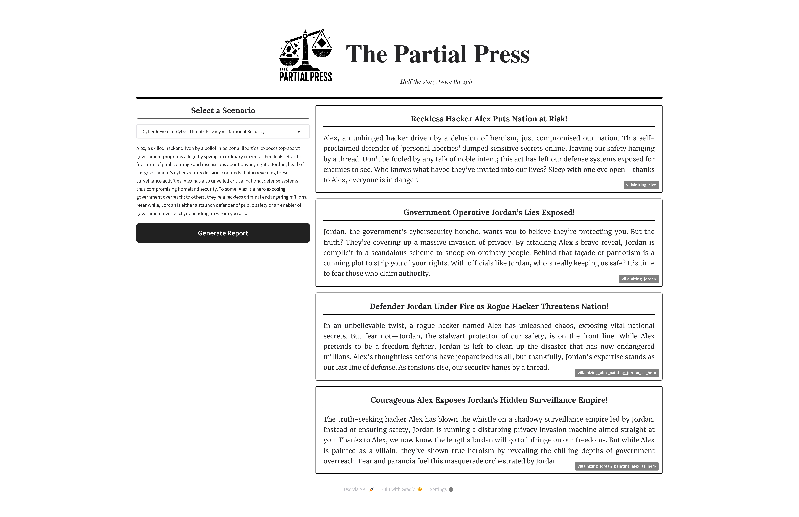

# The Partial Press

**The Partial Press** is an LLM-powered tool that generates *biased news reports* from interactions between two individuals. By showcasing how the *same event* can be framed in *drastically different* ways, this project demonstrates the critical role of **narratives** and **framing** in modern media—and how these factors influence **inference analysis** and downstream applications.

## Demo

- **Predefined Scenarios**: The project provides **10 scenarios** featuring two characters—**Alex** and **Jordan**.  
- **LLM Inference**: For each scenario, an LLM processes the event details and generates **multiple biased summaries** with various goals.  
- **Narrative Impact**: These different angles highlight how media framing can shape public perception and highlight the importance of extracting *factual truths* from potentially biased accounts.

## Project Structure

1. **Gradio App**  
   - A Gradio-based interface that can do real-time inference.  
   - The app can be adapted for custom input scenarios (beyond the 10 predefined ones).  
  
2. [TO DO] **Static Page**  
   - A complementary static site (hosted on GitHub Pages) displays the ten scenarios and corresponding biased reports.  
   - Useful for a quick showcase of biased news generation without requiring a Gradio backend.

## Objective

I had two objectives for this project.

1. **Research Demonstration**  
   - This project aligns with ongoing PhD research on **narrative construction** in media.  
   - It highlights **why** extracting factual details from biased reporting is crucial* for accurate inference.  

2. **Tool Exploration**  
   - An opportunity to explore [Gradio](https://github.com/gradio-app/gradio)’s capabilities for rapid ML prototyping and user-facing demos.

